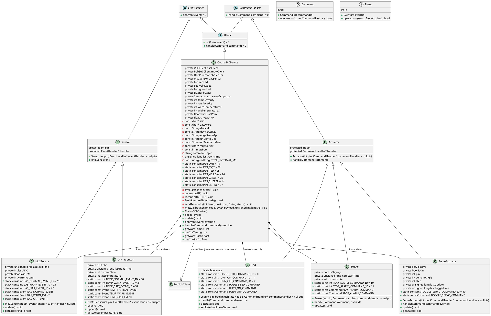

The following PlantUML diagram illustrates the classes of the Cocina360 Device (C++ Edition), spanning both the Modest IoT Nano-framework core (`Command`, `Event`, `CommandHandler`, `EventHandler`, `Device`, `Sensor`, `Actuator`) and the project-specific classes (`Dht11Sensor`, `Mq2Sensor`, `Led`, `Buzzer`, `ServoActuator`, `Cocina360Device`), along with their attributes, methods, and relationships. `Cocina360Device` also aggregates a `PubSubClient` (MQTT) connection used to deliver remote actuator commands, such as toggling the `ServoActuator`.

